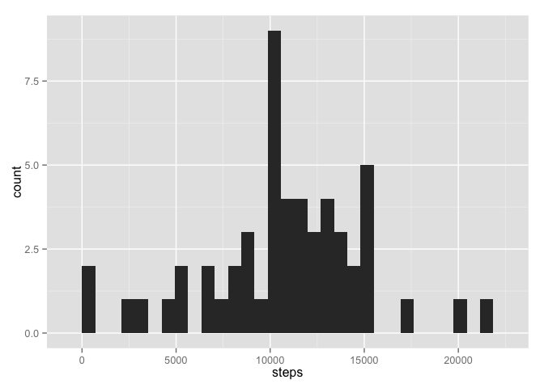
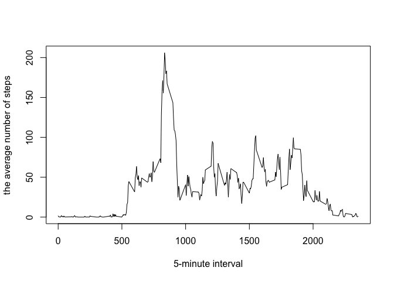
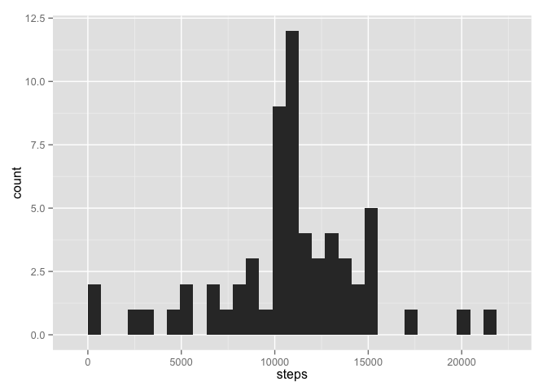
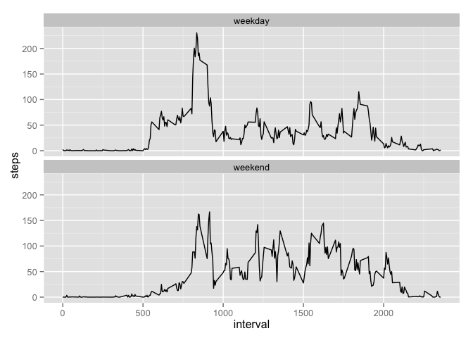

# Reproducible Research: Peer Assessment 1
Seungyoon Lee  
January 16, 2015  

### Loading and preprocessing the data

Show any code that is needed to

1. Load the data (i.e. read.csv())

```r
unzip("activity.zip")
data <- read.table("activity.csv", sep=',', na.strings="NA", header=TRUE, stringsAsFactors=FALSE)
```

2. Process/transform the data (if necessary) into a format suitable for your analysis

```r
#library(lubridate)
#data[,2] <- ymd(data[,2])
data[,2] <- as.Date(data[,2])
```


### What is mean total number of steps taken per day?
For this part of the assignment, you can ignore the missing values in the dataset.

1. Make a histogram of the total number of steps taken each day

```r
library(ggplot2)
steps_per_date <- aggregate(steps ~ date, data, sum)
#qplot(steps_per_date[,2], data=steps_per_date, geom="histogram")
#ggplot(steps_per_date, aes(x=date, y=steps)) +
#    geom_histogram(stat = "identity") +
#    labs(x = "Date", y = "total number of steps") + 
#    theme(axis.text.x = element_text(angle = 90, hjust = 1))
ggplot(steps_per_date, aes(x=steps)) + geom_histogram()
```

 

2. Calculate and report the **mean** and **median** total number of steps taken per day

```r
mean(steps_per_date[,2])
```

```
## [1] 10766.19
```

```r
median(steps_per_date[,2])
```

```
## [1] 10765
```

### What is the average daily activity pattern?

1. Make a time series plot (i.e. type = "l") of the 5-minute interval (x-axis) and the average number of steps taken, averaged across all days (y-axis)


```r
avg_steps_per_interval <- aggregate(steps ~ interval, data, mean)
plot(avg_steps_per_interval[,1], avg_steps_per_interval[,2],
     type="l", xlab="5-minute interval", ylab="the average number of steps")
```

 

2. Which 5-minute interval, on average across all the days in the dataset, contains the maximum number of steps?


```r
avg_steps_per_interval <- aggregate(steps ~ interval, data, mean)
max_steps <- max(avg_steps_per_interval[,2])
avg_steps_per_interval[avg_steps_per_interval[,2]==max_steps,1]
```

```
## [1] 835
```

### Imputing missing values

Note that there are a number of days/intervals where there are missing values (coded as NA). The presence of missing days may introduce bias into some calculations or summaries of the data.

1. Calculate and report the total number of missing values in the dataset (i.e. the total number of rows with NAs)


```r
sum(is.na(data))
```

```
## [1] 2304
```

2. Devise a strategy for filling in all of the missing values in the dataset. The strategy does not need to be sophisticated. For example, you could use the mean/median for that day, or the mean for that 5-minute interval, etc.

*Since some date, for example, 2012-10-01, has all NA values for all intervals,
I'll take average steps for that interval across all dates to fill out NA values*

3. Create a new dataset that is equal to the original dataset but with the missing data filled in.


```r
new_data <- data
# take the mean for that 5-minute interval - some date has all NA across all interval
for (i in 1:nrow(data)) {
    if (is.na(new_data[i,1])) {
        missing_interval <- new_data[i,3]
        missing_index <- avg_steps_per_interval[,1]==missing_interval
        new_data[i,1] <- avg_steps_per_interval[missing_index,2]
    }
}
```

4. Make a histogram of the total number of steps taken each day and Calculate and report the mean and median total number of steps taken per day. 


```r
steps_per_date <- aggregate(steps ~ date, new_data, sum)
ggplot(steps_per_date, aes(x=steps)) + geom_histogram()
```

 

```r
mean(steps_per_date[,2])
```

```
## [1] 10766.19
```

```r
median(steps_per_date[,2])
```

```
## [1] 10766.19
```

* Do these values differ from the estimates from the first part of the assignment?  *YES*

* What is the impact of imputing missing data on the estimates of the total daily number of steps? *imputing missing value on the original data set gives higher steps across date*

### Are there differences in activity patterns between weekdays and weekends?

For this part the weekdays() function may be of some help here. Use the dataset with the filled-in missing values for this part.

1. Create a new factor variable in the dataset with two levels – “weekday” and “weekend” indicating whether a given date is a weekday or weekend day.


```r
day <- factor(c("weekday", "weekend"))
for (i in 1:nrow(new_data)) {
    if (weekdays(new_data[i,2]) == "Saturday")
        day[i] <- "weekend"
    else if (weekdays(new_data[i,2]) == "Sunday")
        day[i] <- "weekend"
    else
        day[i] <- "weekday"
}
new_data$day <- day
```

2. Make a panel plot containing a time series plot (i.e. type = "l") of the 5-minute interval (x-axis) and the average number of steps taken, averaged across all weekday days or weekend days (y-axis). See the README file in the GitHub repository to see an example of what this plot should look like using simulated data.


```r
avg_steps_per_interval <- aggregate(steps ~ interval + day, new_data, mean)
ggplot(avg_steps_per_interval, aes(interval, steps)) + geom_line() + facet_wrap(~day, nrow=2)
```

 

